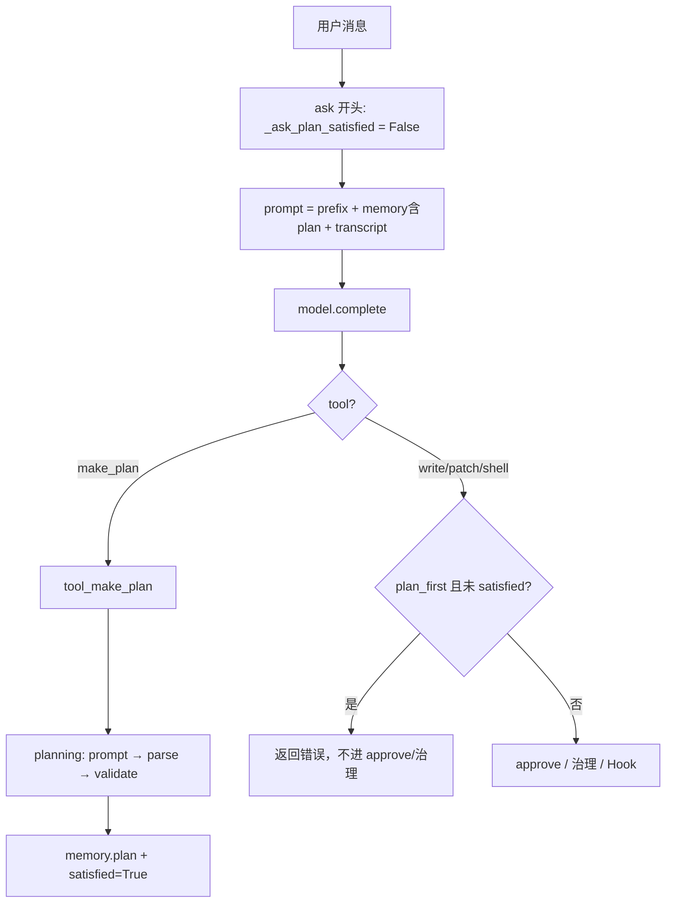

# Phase 3 首项说明（中文）

> **范围**：仅 Phase 3 **首项**（`make_plan` + `memory.plan` + `--plan-first`）。  
> **阶段状态**：首项已结项；Phase 3 整体仍进行中（见 [`struct/phase3.md`](./struct/phase3.md) §6）。  
> **英文用户文档**：[`../README.md`](../README.md) § Task Planning (Phase 3)

---

## 1. 一句话总结

Phase 3 首项让 Agent **能把复杂任务拆成带验收标准的步骤清单**，存进 session，再按 Phase 1 的 diff/审批 和 Phase 2 的 trace 去改代码；可选 `--plan-first` 强制「先规划再动 risky 工具」。

---

## 2. 相对 Phase 2，多解决了什么

| Phase 2 已有 | Phase 3 首项补上 |
|--------------|------------------|
| 工具可观测（Hook、终端 trace） | **任务级规划**（拆步骤 + acceptance） |
| 改文件有治理 | 复杂需求时**先想清楚再改**（可选强制） |
| `delegate` 只读调查 | **`make_plan` 单次规划**（不是调查，是 checklist） |

---

## 3. 你能怎么用

| 方式 | 说明 |
|------|------|
| **默认** | 模型根据 prompt 规则自主决定何时 `make_plan` |
| **`--plan-first`** | 每条用户消息（一次 `ask`）必须先成功 `make_plan`，才能 `write_file` / `patch_file` / `run_shell` |
| **REPL `/memory`** | 查看当前 task、**plan 摘要**、files、notes |
| **调查再规划** | 先 `read_file` / `search`，把发现写入 `make_plan` 的 `context` |

示例：

```bash
uv run mini-coding-agent --plan-first --approval ask "给项目加单元测试并跑 pytest"
```

---

## 4. `delegate` 和 `make_plan` 怎么选

| | `delegate` | `make_plan` |
|---|------------|-------------|
| **目的** | 只读子 Agent **调查**仓库 | **一次调用**产出任务级计划 JSON |
| **内部** | 多步 tool 循环（有 `max_steps`） | **单次** `model_client.complete()` |
| **输出** | 自然语言调查结论 | 结构化 `steps[]` + acceptance |
| **depth** | 仅 `depth < max_depth` 注册 | **各层都有**（含 read_only 子 Agent） |
| **之后** | 主 Agent 自己决定怎么改 | 主 Agent **对照 plan** 逐步用 risky/safe 工具 |

---

## 5. 一次请求怎么走（代码路径）



要点：

- `make_plan` **不占用**「调查型」子 Agent，也**不替代** `run_tool` 里对 write 的治理。
- `--plan-first` 门控在 `_execute_tool_after_validation`，在 **approve 与 diff 治理之前**。

---

## 6. 代码变动清单

| 文件 | 变更类型 | 职责 |
|------|----------|------|
| **`mini_coding_agent/planning.py`** | 新增 | planning prompt、JSON 解析/校验、工具返回格式 |
| **`mini_coding_agent/agent.py`** | 修改 | 注册 `make_plan`；`memory.plan`；`memory_text` plan 块；`--plan-first` 门控；`tool_make_plan` |
| **`mini_coding_agent/cli.py`** | 修改 | `--plan-first` 旗标 → `plan_first` |
| **`tests/test_mini_coding_agent.py`** | 修改 | +11 个 Phase 3 用例 |
| **`README.md`** | 修改 | § Task Planning (Phase 3) |
| 其他 `mini_coding_agent/*.py` | 注释/文案 | 全包中文注释与 REPL 帮助等（用户后续整理，**无行为变更**） |

### 关键符号

| 符号 | 位置 | 作用 |
|------|------|------|
| `PLAN_MAX_STEPS` | `planning.py` | 最多 12 步 |
| `build_planning_prompt` | `planning.py` | 中文规划 prompt（字段名英文、值建议中文） |
| `tool_make_plan` | `agent.py` | 单次 complete → 写 `memory.plan` |
| `_ask_plan_satisfied` | `agent.py` | 本轮 ask 是否已成功规划 |
| `plan_first` | `agent.py` / `cli.py` | CLI `--plan-first` |

### 工具返回约定（当前实现）

| 情况 | 前缀/格式 |
|------|-----------|
| 成功 | `规划成功` + 摘要 + `<plan_json>...</plan_json>` |
| 失败 | `错误：make_plan 失败：...`（**不**更新 `memory.plan`） |
| `--plan-first` 拦截 | `错误：已启用 --plan-first，请先...` |

---

## 7. Session 里 plan 长什么样

路径：`.mini-coding-agent/sessions/<id>.json` → `memory.plan`

```json
{
  "goal": "为用户目标精炼表述",
  "steps": [
    {
      "id": "1",
      "title": "任务级步骤标题",
      "acceptance": "验收标准",
      "risky_hint": "可选"
    }
  ],
  "assumptions": ["假设"],
  "out_of_scope": ["明确不做"]
}
```

`/reset` 会清空 plan；**不会**单独写 `.mini-coding-agent/plan.md`。

---

## 8. 已知限制

- **不自动按步骤执行** plan；无 `mark_step_done` 状态机。
- **plan 质量**依赖模型与 planning prompt；benchmark 暂缓。
- **`--plan-first` 按每条用户消息重置**；不是「整个 session 只规划一次」。
- 规划 prompt 要求**字段名英文、内容中文**（与早期英文 plan_ok 版本不同，以代码为准）。

---

## 9. 文档与验收索引

| 文档 | 用途 |
|------|------|
| [`struct/phase3.md`](./struct/phase3.md) | 阶段边界、Done Definition、后续项 |
| [`command/PHASE3-OVERVIEW.md`](./command/PHASE3-OVERVIEW.md) | 派活总览 |
| [`feedback/P3-MAKE-PLAN.md`](./feedback/P3-MAKE-PLAN.md) | 实现方案与契约自证 |
| [`feedback/P3-DOCS.md`](./feedback/P3-DOCS.md) | README 文档验收 |
| [`feedback/P3-REVIEW.md`](./feedback/P3-REVIEW.md) | 首项独立复验结论 |

---

## 10. Phase 3 后续（未做）

见 [`struct/phase3.md`](./struct/phase3.md) §6：规划与执行衔接、shell 可选阻断；benchmark **暂缓**。

---

*主 Agent 维护 · 与代码同步于 2026-06-02*
