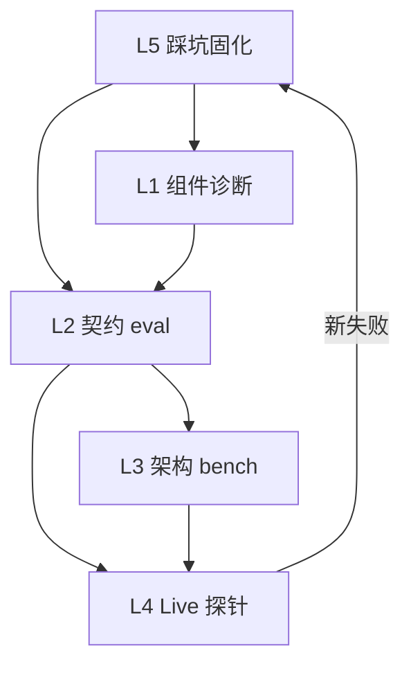

# 五层 Eval 体系（L1–L5）

> 返回索引：[`README.md`](./README.md) · 设计总览：[`01-design-overview.md`](./01-design-overview.md)

---

## 1. 体系总览

```
┌─────────────────────────────────────────────────────────────────────┐
│ L1  组件诊断 pytest（CI 必绿，零 LLM）                               │
│     tests/diagnostic/  ← 当前：test_slots_locate.py（SL/L 系列）      │
│     分散：test_harness_gate · test_generate_robust · verify_align   │
├─────────────────────────────────────────────────────────────────────┤
│ L2  管线契约 eval（CI 必绿，FakeModel + tasks.json）                 │
│     tests/test_eval_contract.py                                     │
│     architecture + fake_script → pipeline_ok + outcome_ok 双断言    │
├─────────────────────────────────────────────────────────────────────┤
│ L3  架构维度 bench（CI，FakeModel 为主）                             │
│     dimension: retry / decoy / gate_boundary / no_rig / multi_file  │
│     eval/tasks.json 扩展 B1–B5                                      │
├─────────────────────────────────────────────────────────────────────┤
│ L4  Live 能力探针（手动 / nightly，Ollama）                          │
│     eval/run_eval.py — outcome_ok + failure_type + observability    │
├─────────────────────────────────────────────────────────────────────┤
│ L5  踩坑固化（持续，随 bug 增长）                                    │
│     docs/eval/QA_LOG.md → tests/regression/test_discovered_bugs.py  │
└─────────────────────────────────────────────────────────────────────┘
```

| 层 | 回答的问题 | 失败意味着什么 | CI |
|----|------------|----------------|-----|
| L1 | 每个**模块**输入→输出是否正确？ | 节点实现有 bug | ✅ 必绿 |
| L2 | **整条 DAG** 是否按任务契约执行？ | 管线接线或契约设计错误 | ✅ 必绿 |
| L3 | **架构能力**（retry/decoy/…）是否被覆盖且通过？ | 某架构维度未实现或退化 | ✅ 建议必绿 |
| L4 | **真实模型**下 harness 够不够用？ | 模型能力或 prompt 瓶颈 | ❌ 手动 |
| L5 | 历史 bug 是否**复发**？ | 修复未沉淀或回归 | ✅ 随条目增长 |

---

## 2. L1：组件诊断

### 2.1 职责

**不跑完整 pipeline**，单独测每个模块的输入→输出契约。等价于 KWCode `kaiwu/tests/diagnostic/` 的缩小版。

### 2.2 目录结构（**实际**，2026-06-08）

```
tests/diagnostic/
├── __init__.py
└── test_slots_locate.py     # SL-01–SL-24 子集 + L-01–L-07；D1/D2/D3 门槛
```

**规划尚未独立成文件的模块**（由现有 harness 测试覆盖，见 [`06-l1-diagnostic-spec.md`](./06-l1-diagnostic-spec.md) §10）：

| 规划文件 | 实际覆盖 |
|----------|----------|
| `test_gate_parse.py` | `tests/test_harness_gate.py`（`parse_gate_response`） |
| `test_protocol_generate.py` | `tests/test_generate_robust.py`（`protocol.parse`） |
| `test_verify_rules.py` | `tests/test_harness_verify_align.py` |
| `test_error_format.py` | `tests/test_harness_error_format.py` |

### 2.2.1 目标结构（可选扩展）

```
tests/diagnostic/
├── test_gate_parse.py          # 从 harness_gate 抽纯函数用例（可选）
├── test_protocol_generate.py   # 从 test_generate_robust 抽 parse 用例（可选）
└── …
```

**与现有测试的分工**：

| 现有文件 | 侧重 | L1 diagnostic 侧重 |
|----------|------|-------------------|
| `test_harness_gate.py` | E2E Gate 行为 | 纯函数级 parse/route 规则 |
| `test_harness_locate_snippets.py` | 行为断言 | **量化门槛**（D1–D3 准确率） |
| `test_generate_robust.py` | generate 节点 E2E | protocol 纯解析边界 |
| `test_harness_verify_align.py` | harness verify E2E | verify_rules 纯函数 |

### 2.3 量化门槛（出厂条件）

| ID | 指标 | 门槛 | 规格文档 |
|----|------|------|----------|
| D1 | slots 文件提取准确率 | ≥ 90%（≥18/20 样本） | [`06-l1-diagnostic-spec.md`](./06-l1-diagnostic-spec.md) |
| D2 | slots 符号提取准确率 | ≥ 85% | 同上 |
| D3 | locate snippet 含源码行比例 | 有 files_hint 时 **100%** | 同上 |

### 2.4 CI 命令

```bash
python -m pytest tests/diagnostic/ -q
```

---

## 3. L2：管线契约 eval

### 3.1 职责

对 `tasks.json` 中含 `fake_script` 的任务，用 `FakeModelClient` 跑完整 `handle_ask(harness=True)`，断言：

1. `pipeline_ok == True`（Gate/locate/generate/verify/retry/fallback 契约）
2. `outcome_ok == True`（grading 终判）

**关键**：任务清单与测试**同一来源**，解决「tasks.json 与 test_harness_* 脱节」问题。

### 3.2 入口

```
tests/test_eval_contract.py
```

```python
@pytest.mark.parametrize("task", load_tasks_with_fake_script())
def test_pipeline_contract(task, tmp_path):
    root = setup_task_workspace(tmp_path, task)
    agent = build_agent(root, FakeModelClient(task["fake_script"]))
    stderr = capture_stderr(handle_ask, agent, task["message"], harness_enabled=True)

    contract = assert_pipeline_contract(task, agent, stderr)
    outcome_err, _ = check_task_grading(root, task)

    assert contract.pipeline_ok, contract.failures
    assert outcome_err is None, outcome_err
```

### 3.3 契约任务（7 条，Batch 5 冻结）

| 类别 | 数量 | 说明 |
|------|------|------|
| L2/L3 契约 | **7** | 含 `architecture` + `fake_script` |
| L4-only | **12** | 无契约字段；仅 live 探针 |

完整划分：[`eval/L4-ONLY-DECISION.md`](../../eval/L4-ONLY-DECISION.md)

| task_id | 覆盖架构点 |
|---------|------------|
| `nameerror_calc` | Gate + slots(traceback) + generate + py_compile verify |
| `off_by_one_sum` | verify 必须 pytest + lock_tests |
| `bench_retry_off_by_one` | B1 verify→generate retry |
| `bench_decoy_calc_backup` | B2 decoy |
| `bench_gate_explain_boundary` | B3 gate_boundary |
| `bench_no_rig_search` | B4 no_rig |
| `import_chain_rate` | B5 multi_file |

完整 schema 见 [`03-task-schema.md`](./03-task-schema.md)，断言逻辑见 [`07-l2-contract-spec.md`](./07-l2-contract-spec.md)。

### 3.4 CI 命令

```bash
python -m pytest tests/test_eval_contract.py tests/test_eval_runner.py -q
```

---

## 4. L3：架构维度 bench

### 4.1 职责

5 条专项任务，每条测一个**架构维度**，而非「又一条 easy bugfix」。必须含 `architecture` + `fake_script` + `dimension` 标签。

| ID | dimension | 测的架构点 |
|----|-----------|------------|
| B1 | `retry` | verify→generate 重试（2 步 fake_script） |
| B2 | `decoy` | Locate 不被 calc_backup.py 误导 |
| B3 | `gate_boundary` | explain 问句不误入 fix_bug |
| B4 | `no_rig` | 无 index.db 时 search/files_hint 回退 |
| B5 | `multi_file` | 改 root cause（rates.py）非 symptom（app.py） |

完整任务设计（setup_files、message、fake_script）见 [`08-l3-arch-bench-spec.md`](./08-l3-arch-bench-spec.md)。

### 4.2 与现有 15 条任务的关系

| 类别 | 数量 | L3 关系 |
|------|------|---------|
| easy 12 条 | 能力探针（L4） | 逐步补 `architecture`，非全部升 L3 |
| medium 3 条 | 部分已覆盖架构维度 | `import_chain_rate` 升格为 B5 |
| 新增 B1/B2/B3/B4 | 4 条 | 填补专项空白 |

### 4.3 CI 命令

L3 任务纳入 `test_eval_contract.py` parametrized，与 L2 同一入口：

```bash
python -m pytest tests/test_eval_contract.py -q
```

---

## 5. L4：Live 能力探针

### 5.1 职责

用 **Ollama 真实模型** 跑 `eval/run_eval.py`，度量 agent 在 fix_bug 路径上的**真实能力**。增强报告：

- `pipeline_ok` / `outcome_ok` / `failure_type`
- `observability`（session 字段）
- failure_type **聚合表** + 建议优先改动

### 5.2 用法（现有 + 规划）

```bash
# 全量 live
python eval/run_eval.py

# 单条试跑
python eval/run_eval.py --task nameerror_calc

# 严格管线模式（规划）
python eval/run_eval.py --strict-pipeline

# 基线（Phase 7.2 后正式版）
python eval/run_eval.py --save-baseline eval/baselines/live-qwen2.5-coder-7b-post72.json
python eval/run_eval.py --compare eval/baselines/live-qwen2.5-coder-7b-post72.json
```

### 5.3 与 L1–L3 的关系

| 场景 | 用哪层 |
|------|--------|
| 改 verify_rules.py | L1 + L2 必须先绿 |
| 改 generate.py | L1 + L2 + L3(retry) 绿后再跑 L4 |
| 评估模型换型 | 仅 L4 + baseline compare |
| CI 合并前 | **只跑 L1–L3**，不阻塞于 Ollama |

完整报告规格见 [`09-l4-live-probe-spec.md`](./09-l4-live-probe-spec.md)。

---

## 6. L5：踩坑固化

### 6.1 职责

把 live / 人工发现的 bug ** institutionalize**，避免同一问题反复出现。

### 6.2 流程

```
1. live eval 或人工测试发现新失败
2. 根因明确 → 写入 docs/eval/QA_LOG.md（failure_type + 文件:行 + 修复）
3. 补 tests/regression/test_discovered_bugs.py 中的一个 TestCase class
4. 优先在 L1/L2 复现（FakeModel，不依赖 Ollama）
5. 修复代码 → L1/L2/L5 全绿 → 可选 L4 验证
6. 下一轮 eval 确认不再复发
```

### 6.3 文件

| 文件 | 用途 |
|------|------|
| `docs/eval/QA_LOG.md` | 人类可读的踩坑轮次记录 |
| `tests/regression/test_discovered_bugs.py` | 机器可跑的回归 class |

---

## 7. CI 策略（推荐）

### 7.0 五层命令速查

| 层 | 命令 |
|----|------|
| L1 | `pytest tests/diagnostic/ -q` |
| L2/L3 | `pytest tests/test_eval_contract.py -q` |
| L4 | `python eval/run_eval.py`（需 Ollama） |
| L5 | `pytest tests/regression/ -q` |
| 框架 | `pytest tests/test_eval_runner.py -q` |

详见 [`eval/README.md`](../../eval/README.md)。

### 7.1 必跑（每次 PR / push）

```bash
python -m pytest tests/diagnostic/ \
                 tests/test_eval_contract.py \
                 tests/test_eval_runner.py \
                 tests/test_harness_*.py \
                 tests/test_generate_robust.py \
                 -q

python -m ruff check .
```

### 7.2 不纳入 CI 默认

```bash
python eval/run_eval.py   # 需 Ollama，手动或 nightly workflow
```

### 7.3 建议的 GitHub Actions 注释（EV-7 遗留修正）

`.github/workflows/ci.yml` 当前仅 `pytest -q`。波次 D 结项时建议显式注释：

```yaml
# L1–L3 架构 eval（零 LLM，CI 必绿）
# L4 live 探针：手动 python eval/run_eval.py，不阻塞 CI
```

---

## 8. FakeModel 与 Live 的分工

| | FakeModel（L2/L3） | Ollama（L4） |
|--|-------------------|--------------|
| **测什么** | 管线契约、架构维度 | 模型 + prompt 真实能力 |
| **稳定性** | 确定性，CI 可绿 | 受模型/硬件影响 |
| **数据源** | `tasks.json` → `fake_script` | `tasks.json` → `message` + setup |
| **通过语义** | pipeline_ok AND outcome_ok | passed（默认 outcome_ok；7.2 后无 fallback_open） |
| **失败归因** | 契约断言直接报字段名 | failure_type + observability |

**禁止**：用 L2 全绿冒充 L4 能力；用 L4 低分否定 L2 架构正确性。

---

## 9. 层间依赖图



**实施顺序**：L1 与 L2-P0 可并行 → L3 → L4 报告增强 → L5 持续。

---

*02-five-layer-system.md · Batch 5 对齐实际布局 · 2026-06-08*
