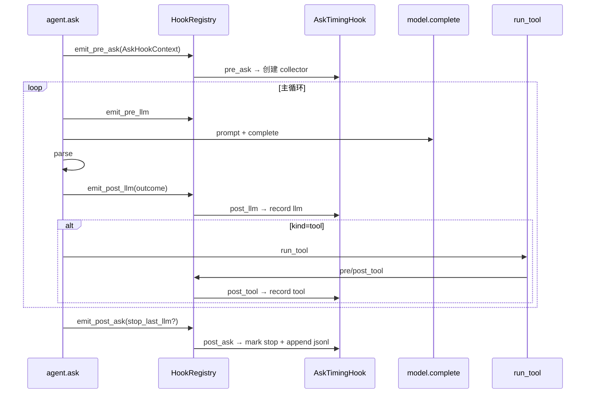

# 子 Agent 回报：HOOK-ASK-EVENTS

---

## 元信息

- **TASK_ID**: HOOK-ASK-EVENTS
- **状态**: 完成

---

## 方案摘要（IMPLEMENT 必填）

### 事件模型扩展

`HookRegistry` 新增 4 类事件（observe-only、`_dispatch` fail-open 不变）：

| 事件 | 触发点 | Context | 计时 |
|------|--------|---------|------|
| `pre_ask` / `post_ask` | `agent.ask()` 入口 / `finally` | `AskHookContext` | registry 在 pre/post 间算 `duration_ms` |
| `pre_llm` / `post_llm` | 主循环每轮 prompt 前 / parse 后 | `LlmHookContext` | registry 在 pre/post 间算 `duration_ms` |
| `pre_tool` / `post_tool` | `invoke_tool_with_hooks`（不变） | `ToolHookContext` | 不变 |



### AskTiming 归位

- **删除** `mini_coding_agent/ask_timing.py`
- **迁入** `hooks/ask_timing_hook.py`（`AskTimingCollector`、`append_ask_timing_log`、`AskTimingHook`）
- **装配** 仅经 `register_builtin_hooks` + `HookConfig.ask_timing`（默认 `True`）
- **collector 生命周期** 绑在 `AskHookContext.collector`（`pre_ask` 创建）；tool 侧经 `HookRegistry._active_ask_ctx` 取 collector（无 `agent._ask_timing`）

### `agent.ask()` 目标形态

- 递增 `session["ask_count"]` → 构建 `AskHookContext` → `emit_pre_ask`
- 循环内：`emit_pre_llm` → prompt → complete → parse → 设 `outcome` → `emit_post_llm` → 分支处理
- 步数/attempt 上限：`ask_ctx.stop_last_llm = True`（`post_ask` 内 `mark_last_llm_stop`）
- `finally`：`emit_post_ask`（jsonl 落盘在 `AskTimingHook.post_ask`）

### 配置

- `HookConfig.ask_timing: bool = True`
- `hooks.yaml` → `builtin_hooks.ask_timing`
- CLI `--no-ask-timing`（与 `--no-session-trace` 同级）
- `enable_trace_hook=False`：不注册任何内置 Hook（含 AskTiming）

### 与 OPT-ASK-TIMING 差异

| 项 | OPT-ASK-TIMING | HOOK-ASK-EVENTS |
|----|----------------|-----------------|
| 模块位置 | 包根 `ask_timing.py` | `hooks/ask_timing_hook.py` |
| LLM 计时 | `agent.ask()` 手写 `perf_counter` | registry `emit_pre/post_llm` |
| collector 挂载 | `agent._ask_timing` | `AskHookContext.collector` + `_active_ask_ctx` |
| Hook 注册 | `agent.__init__` 直接构造 | `builtin.py` + yaml/CLI |
| jsonl 路径/字段/方案 A | 一致 | **无行为变化** |
| `stop` outcome | `mark_last_llm_stop()` 在 ask 内 | `ask_ctx.stop_last_llm` → `post_ask` 内 mark |

---

## 契约与 Done Definition 自证

| 条目 | 是否满足 | 证据（测试名 / 行为说明） |
|------|----------|---------------------------|
| `register` 接受 pre/post ask/llm；未知事件报错 | ✅ | `test_hook_registry_rejects_unknown_event` |
| `register_hook("post_llm", ...)` 可工作 | ✅ | `test_register_post_llm_hook_observes_outcome` |
| `agent.ask()` 无 `_ask_timing`、无根目录 import | ✅ | 代码审查；grep 无 `_ask_timing` |
| `AskTimingHook` 仅在 `hooks/ask_timing_hook.py`，经 `builtin.py` | ✅ | 目录结构 |
| yaml/CLI 可关 `ask_timing` | ✅ | `test_ask_timing_disabled_via_hook_config`；`--no-ask-timing` in cli |
| OPT-ASK-TIMING 8 项行为测试仍绿 | ✅ | 全部 `test_ask_timing_*` |
| Phase 2 trace/shell/custom hook 无回归 | ✅ | 原有用例仍绿 |
| 包根无 `ask_timing.py` | ✅ | 已删除 |
| 全量 pytest + ruff | ✅ | 82 passed, 1 skipped；ruff All checks passed |
| 无新 pip 依赖 | ✅ | 标准库 + 既有 PyYAML |

---

## 交付物

| 路径 | 说明 |
|------|------|
| `mini_coding_agent/hooks/registry.py` | `AskHookContext`、`LlmHookContext`、ask/llm emit |
| `mini_coding_agent/hooks/ask_timing_hook.py` | 从包根迁入 |
| `mini_coding_agent/hooks/builtin.py` | `ask_timing` 装配 |
| `mini_coding_agent/hooks/hook_config.py` | `ask_timing` + yaml + CLI |
| `mini_coding_agent/hooks/hooks.yaml.example` | 新建，含 `ask_timing` 键 |
| `mini_coding_agent/hooks/__init__.py` | 导出新类型 |
| `mini_coding_agent/agent.py` | ask 只 emit；移除手写计时 |
| `mini_coding_agent/cli.py` | `--no-ask-timing` |
| `tests/test_mini_coding_agent.py` | +3 测试；fail-open patch 路径更新 |
| ~~`mini_coding_agent/ask_timing.py`~~ | **已删除** |
| `docs/feedback/HOOK-ASK-EVENTS.md` | 本回报 |

---

## 验证结果

```
$ python -m pytest tests/test_mini_coding_agent.py -q --tb=no
...........s............................................................ [ 86%]
...........                                                              [100%]
82 passed, 1 skipped in 60.11s

$ python -m ruff check mini_coding_agent/ tests/
All checks passed!
```

---

## 风险与未解决问题

- **`HookRegistry._active_ask_ctx`**：tool Hook 访问 ask collector 的内部指针；嵌套 ask（若未来出现）须保证栈式或显式传递。
- **异常 mid-ask**：`finally` 仍 `emit_post_ask`，部分 events + jsonl 落盘（与 OPT-ASK-TIMING 一致）。
- **`enable_trace_hook=False` 测试**：不写 jsonl；需 ask timing 时用默认 `build_agent` 或 `HookConfig(ask_timing=True)`。

---

## 主 Agent 复审（由主 Agent 填写）

- **结论**: 通过
- **备注**: 主 Agent 独立复跑 pytest（82 passed, 1 skipped）与 ruff；ask/llm 触发点、AskTiming 归位 `hooks/`、`builtin`+yaml+`--no-ask-timing`、OPT-ASK-TIMING 8 测无回归。`_active_ask_ctx` 为已知内部桥接，嵌套 ask 时再评估。已更新 `02-codebase-reference` §10。
