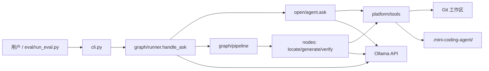
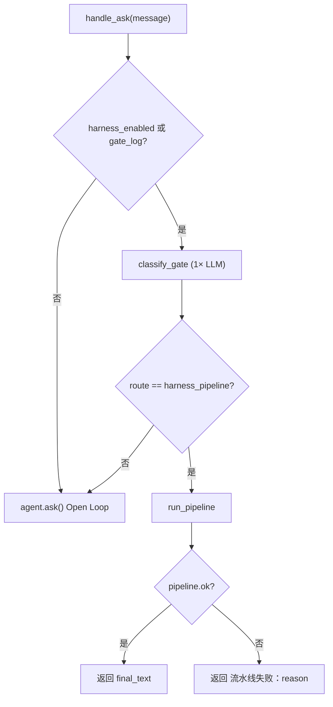
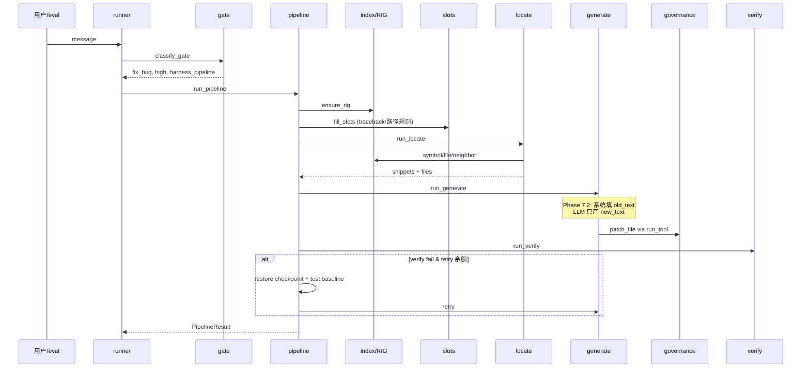

# 系统架构总览

> **读者**：维护代码、跑 eval、或 30 分钟内理解本项目的人。  
> **更深**：模块速查 [`02-codebase-reference.md`](./02-codebase-reference.md) · 分批整理计划 [`project-architecture-plan.md`](./project-architecture-plan.md) · 当前迭代 [`phase7.md`](./phase7.md)

---

## 1. 项目是什么

**Mini-Coding-Agent**：本地 Git 工作区上的编码 Agent，通过 **Ollama** 调用大模型，用**结构化 tool** 读/搜/写代码。

| 属性 | 说明 |
|------|------|
| 包 | `mini_coding_agent/` |
| CLI | `mini_coding_agent.py` / `mini-coding-agent` |
| 模型 | `OllamaModelClient` → `POST /api/generate` |
| 持久化 | `<repo>/.mini-coding-agent/`（session、checkpoint、rig.db、skills、hooks） |
| 评测 | `eval/` 黄金闭环 + 五层测试（L1–L5） |

**两条执行路径**：

1. **Open Loop**（默认）— 模型自由多轮选 tool  
2. **Graph Harness**（`--harness on` 或 eval）— Gate 分类 → 静态 DAG → 确定性节点

---

## 2. 系统上下文



| 外部依赖 | 用途 | 必需？ |
|----------|------|--------|
| Ollama | Gate / Generate / Open 的 LLM | CLI 与 L4 eval |
| SQLite（stdlib） | RIG 图谱 `rig.db` | Harness 自动 `ensure_rig` |
| PyYAML | Hook 配置 | 可选 |
| ripgrep | `search` 加速 | 可选，有 Python 回退 |
| pytest | verify 节点、eval 终判 | 任务含 `tests/` 时 |

---

## 3. 代码分层

```
mini_coding_agent/
├── cli.py                 # REPL、--harness、rig build
├── platform/              # 两种 mode 共用
│   ├── tools/             # 注册、校验、run_tool、implementations
│   ├── governance.py      # write/patch：diff → approve → checkpoint → 写盘
│   ├── protocol.py        # 解析 <tool> / <final>
│   ├── models.py          # OllamaModelClient、FakeModelClient
│   ├── session.py         # SessionStore、CheckpointStore
│   └── hooks/             # pre/post tool、ask、llm
├── modes/
│   ├── open/              # MiniAgent.ask() 自由循环
│   └── graph/             # Gate + DAG + 节点
│       ├── runner.py      # handle_ask 入口
│       ├── gate.py        # 意图分类（1× LLM）
│       ├── slots.py       # 槽位规则（无 LLM）
│       ├── planner.py     # 加载 templates/*.json
│       ├── pipeline.py    # ensure_rig → plan → execute_dag
│       ├── executor.py    # 拓扑执行、verify→generate retry
│       ├── harness_trace.py  # stage_trace（eval 可观测）
│       ├── nodes/         # locate / generate / verify / …
│       └── templates/       # 五类意图静态 DAG
└── index/                 # RIG：build / query / store
eval/                      # tasks.json、run_eval.py、runs/、baselines/
tests/                     # L1 diagnostic、L2 契约、harness 回归、L5 踩坑
docs/                      # struct（架构）、eval（五层规格）
```

**分层原则**：

| 层 | 职责 | 不应包含 |
|----|------|----------|
| **platform** | 工具、治理、协议、会话 | 意图/DAG 逻辑 |
| **modes/graph** | 编排、节点、模板 | 直接写盘（须经 run_tool） |
| **modes/open** | 多轮对话循环 | DAG 拓扑 |
| **index** | 离线 AST 图谱 | LLM 调用 |
| **eval** | 任务定义、live 探针、报告 | Agent 业务逻辑 |

---

## 4. 入口与路由

所有用户输入经 `handle_ask(agent, message, harness_enabled=…)`（`modes/graph/runner.py`）。



**路由表（当前行为，Phase 7.2）**：

| 条件 | 路径 |
|------|------|
| `--harness off` 且无 `--gate-log` | 直接 Open，**无 Gate** |
| Gate `confidence=low` 或非法 intent | **Open Loop** |
| Gate `confidence=high` + pipeline intent | **Graph Pipeline** |
| Pipeline 任意节点失败且 retry 耗尽 | **直接错误**（`流水线失败：…`），**不降级 Open** |

> 历史：`phase5-graph.md` 曾写 pipeline 失败会 open 降级；**7.2 已取消**。仅 Gate low 仍走 open。

---

## 5. fix_bug 流水线（核心路径）

Eval 与日常修 bug 的主路径。模板：`modes/graph/templates/fix_bug.json` → `locate → generate → verify`，verify 失败最多 retry generate **2 次**。



### 5.1 各步输入/输出

| 步骤 | LLM? | 输入 | 输出 |
|------|------|------|------|
| **Gate** | 1× | user_message | intent_id, confidence, route, skill? |
| **RIG** | 无 | 工作区 .py | `rig.db`（缺失则 build） |
| **slots** | 无 | message + workspace | goal, files_hint, symbols_hint, test_command? |
| **locate** | 无 | slots | files[], snippets[]（带行号源码） |
| **generate** | 1× | snippets + goal + 待替换原文(7.2) | patch_file / write_file |
| **verify** | 无 | 磁盘状态 | pytest / py_compile / lock_tests |

### 5.2 Phase 7 在 generate 的变更

| 版本 | Generate 行为 |
|------|---------------|
| 7.0 | LLM 自填 `old_text` + `new_text`，易 0 匹配 |
| 7.1 | 写前禁止 patch `tests/`；verify fail 回滚 workspace |
| **7.2** | 系统从磁盘读 **old_text**；LLM 只写 **new_text**；支持 ` ``` ` 代码块兜底 |

详见 [`phase7.2-guided-patch.md`](./phase7.2-guided-patch.md)。

### 5.3 Retry 与回滚

| 触发 | 写盘？ | retry 前动作 |
|------|--------|--------------|
| generate **policy_block**（目标 tests/） | 否 | 无回滚；错误进下次 prompt |
| generate 其他 fail | 视情况 | — |
| **verify fail** | 是（上一轮 patch） | `restore_workspace_for_retry`：checkpoint + tests 快照 |

---

## 6. Open Loop 路径

`MiniAgent.ask()`（`modes/open/agent.py`）：稳定 prefix + history + memory → 循环 `complete → parse → run_tool` 直到 `<final>` 或步数上限。

- **risky 工具**（`write_file` / `patch_file` / `run_shell`）经 approval + governance  
- **与 Graph 共享**：`platform/tools`、`protocol`、`session`、`governance`  
- **CLI 默认**：`--harness off` → 全部走 Open

---

## 7. 写盘治理链（Phase 1）

`write_file` / `patch_file` **不能**直调 implementation，必须：

```
validate_tool → run_tool → governance.run_governed_file_tool
  → diff → approve → checkpoint → atomic write
  → 失败 → restore_checkpoint
```

Graph 的 generate 节点同样经 `agent.run_tool`，与 Open 共用此链。

---

## 8. 离线索引 RIG

| 项 | 说明 |
|----|------|
| 文件 | `<repo>/.mini-coding-agent/rig.db` |
| 构建 | `mini-coding-agent rig build` 或 pipeline 内 `ensure_rig` |
| 内容 | Python 文件、符号、import 边（AST，非 LLM） |
| 消费 | **locate** 节点：`by_symbol` / `by_file` / `one_hop_neighbors` |

pytest 类任务 message 常只点名 `tests/…`；RIG **neighbor** 从 test import 追到源码（如 `sum_first.py`）。

---

## 9. Eval 体系（五层）

| 层 | 命令/位置 | LLM | 回答的问题 |
|----|-----------|-----|------------|
| **L1** | `pytest tests/diagnostic/` | 否 | slots/locate 等组件 I/O |
| **L2/L3** | `pytest tests/test_eval_contract.py` | FakeModel | DAG 是否符合 `architecture` + grading |
| **L4** | `python eval/run_eval.py` | Ollama | 真模型能否修 bug |
| **L5** | `pytest tests/regression/` | FakeModel | QA_LOG 踩坑不复现 |

**任务单一真相源**：`eval/tasks.json`（19 条）。  
**Live 产物**：`eval/runs/` · **基线**：`eval/baselines/`  
**规格**：[`docs/eval/README.md`](../eval/README.md)

### 9.1 L4 报告字段

| 字段 | 含义 |
|------|------|
| `passed` | 默认 = `outcome_ok`（grading 终判） |
| `pipeline_ok` | 有 `architecture` 的任务：契约断言 |
| `failure_type` | 稳定分类（见下表） |
| `observability.stage_trace` | gate/rig/slots/locate/generate/verify 的 input/output |

`--strict-pipeline`：`passed` 同时要求 `pipeline_ok`。

---

## 10. 改哪里：failure_type → 模块

Live eval 或 `stage_trace` 诊断时，优先查此表（与 `eval/run_eval.py` 一致）。

| failure_type | 优先看的代码 |
|--------------|--------------|
| `gate_low` / `gate_wrong_intent` | `modes/graph/gate.py`, `gate_prompt.py` |
| `locate_no_snippet` / `locate_wrong_file` | `modes/graph/nodes/locate.py`, `index/query.py` |
| `generate_protocol` | `platform/protocol.py`, `nodes/generate.py`（代码块/json 围栏） |
| `generate_patch_match` | `nodes/generate.py`, `platform/governance.py` |
| `generate_governance` | `platform/governance.py` |
| `verify_lock_tests` | `modes/graph/verify_rules.py` |
| `verify_pytest` / `verify_py_compile` | `nodes/generate.py`, `nodes/verify.py` |
| `expect_files` | generate 产出 + 任务 `expect_files` 设计 |
| `fallback_open` | **历史**；7.2 后 pipeline 不应再降级 open |
| `exception` | 调用栈 / Ollama 超时 |

---

## 11. 五类意图与 DAG 模板

| intent_id | 模板 | 典型节点链 | Pipeline? |
|-----------|------|------------|-----------|
| `fix_bug` | `fix_bug.json` | locate → generate → verify | ✅ |
| `generate_code` | `generate_code.json` | locate → generate → verify | ✅ |
| `refactor` | `refactor.json` | locate → plan → generate → verify → review | ✅ |
| `explain` | `explain.json` | locate → explain | ✅ |
| `project_ops` | `project_ops.json` | ops | ✅ |

Gate `confidence=low` → 不走上表，回 Open。

---

## 12. 持久化目录

```
<repo_root>/.mini-coding-agent/
├── sessions/<id>.json      # transcript、memory、last_gate、harness_node_outputs、harness_trace
├── checkpoints/<session>/    # 写盘前快照（治理回滚）
├── rig.db                    # RIG 图谱
├── skills/<name>/SKILL.md    # Phase 4 Skill
├── hooks.yaml                # Hook 配置（可选）
└── logs/<session>.jsonl      # ask timing（可选）
```

`/reset` 清空 harness 相关字段与 history，不删 `rig.db`。

---

## 13. 文档导航

| 我想… | 文档 |
|--------|------|
| **总览（本文）** | `ARCHITECTURE.md` |
| **Platform / Open 底座** | [`platform-subsystem.md`](./platform-subsystem.md) |
| **Graph 节点深描** | [`graph-subsystem.md`](./graph-subsystem.md) |
| 模块/工具/API 速查 | [`02-codebase-reference.md`](./02-codebase-reference.md) |
| 架构整理分批计划 | [`project-architecture-plan.md`](./project-architecture-plan.md) |
| Phase 7 Generate 迭代 | [`phase7.md`](./phase7.md) |
| Graph 历史与设计 | [`phase5-graph.md`](./phase5-graph.md) |
| Eval 五层规格 | [`docs/eval/README.md`](../eval/README.md) |
| 跑 live / 看结果 | [`eval/README.md`](../../eval/README.md), [`eval/runs/README.md`](../../eval/runs/README.md) |
| 踩坑记录 | [`docs/eval/QA_LOG.md`](../eval/QA_LOG.md) |

---

## 14. 当前基线快照（2026-06-08）

| 指标 | 值 | 出处 |
|------|-----|------|
| tasks.json | 19 条 | `eval/tasks.json` |
| L2 契约任务 | 7 条 | 含 `architecture` + `fake_script` |
| 全量 live（7 改前） | 7/19 | `eval/runs/live/2026-06-08_full-19tasks.json` |
| 全量 live（7.2 后） | **8/19** | `eval/baselines/live-qwen2.5-coder-7b-post72.json` |
| Generate 专项 8 条（7.2 后） | **5/8** | `eval/runs/README.md` |
| Phase | 7.1 ✅ · 7.2 ✅ · 7.3 📋 | [`phase7.md`](./phase7.md) |

---

*ARCHITECTURE.md · Batch 1 · 与 Phase 7.2 代码对齐 · 2026-06-08*
