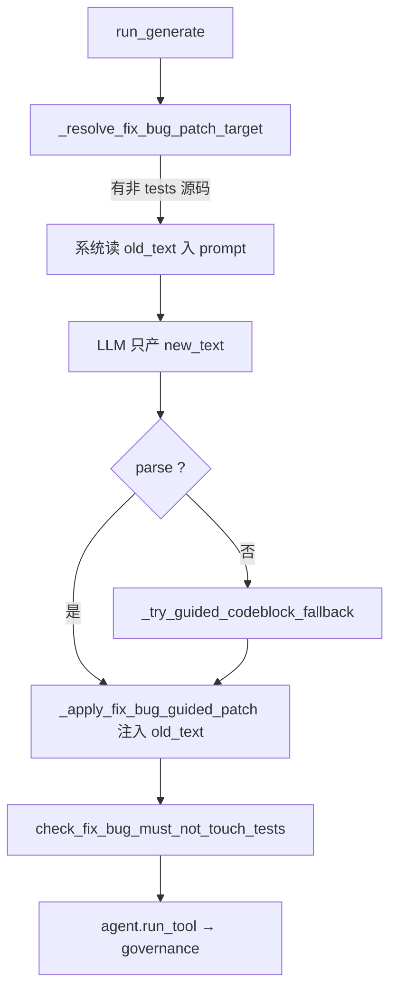

# Graph 子系统 — 节点深描

> **读者**：改 Gate/locate/generate/verify 或读 live eval `stage_trace` 的维护者。  
> **上级文档**：[`ARCHITECTURE.md`](./ARCHITECTURE.md) · [`02-codebase-reference.md`](./02-codebase-reference.md) · [`phase7.2-guided-patch.md`](./phase7.2-guided-patch.md)

---

## 1. 子系统边界

Graph Harness 位于 `mini_coding_agent/modes/graph/`。一次 **pipeline 运行** 的固定前置/后置：

| 阶段 | 模块 | 何时执行 |
|------|------|----------|
| 入口 | `runner.handle_ask` | 每 ask（harness on 或 gate-log） |
| Gate | `gate.classify_gate` | harness on 或 gate-log |
| RIG | `index.ensure_rig` | pipeline 启动时 |
| 规划 | `planner.plan` + `slots.fill_slots` | pipeline 内 |
| 执行 | `executor.execute_dag` | 按模板拓扑跑节点 |
| 追踪 | `harness_trace.record_stage` | 各阶段 append 到 session |

**fix_bug 拓扑**（`templates/fix_bug.json`）：

```
locate → generate → verify
         ↑__________|  verify fail，retry ≤2（回滚后重跑 generate）
```

---

## 2. stage_trace 总览

每次 harness pipeline 运行后，`session.harness_trace` 为 **有序列表**。eval 将其复制到 `observability.stage_trace`。

**典型顺序**（单次 generate、无 retry）：

```
gate → rig → slots → locate → generate → verify
```

retry 时 **generate / verify 会重复出现**（每次 attempt 各记一条 generate trace）。

### 2.1 各 stage 字段对照表

| stage | 写入位置 | `input` 字段 | `output` 字段 |
|-------|----------|--------------|---------------|
| **gate** | `runner.py` | `user_message`, `prompt` | `intent_id`, `confidence`, `route`, `skill`, `raw` |
| **rig** | `pipeline.py` | — | `built`, `db_path`, `files`, `symbols`, `imports` |
| **slots** | `pipeline.py` | `user_message`, `intent_id` | `goal`, `files_hint`, `symbols_hint`, `test_command?`, `skill_name?` |
| **locate** | `harness_trace.record_node_stage` | `slots`（同上 dict） | `ok`, `message`, `files`, `snippets`, `used_rig`, `symbols_hint` |
| **generate** | `generate._record_generate_trace` | `prompt`, `attempt` | `raw`, `ok`, `message`, `tool?`, `args?`, `path?`；`meta.intent_id` |
| **verify** | `record_node_stage` | `intent_id`, `generate_attempt` | `ok`, `message`, `data`（含 `method`: shell/py_compile/lock_tests） |

**session 其它 harness 字段**（非 stage_trace，但 eval observability 会读）：

| 字段 | 含义 |
|------|------|
| `last_gate` | 最近一次 Gate 结果 |
| `last_verify` | 最近一次 verify 摘要 |
| `harness_node_outputs` | 各节点 id → 结果快照 |
| `harness_last_node` | 最后执行的节点 id |

---

## 3. Gate + Slots

### 3.1 Gate

**源码**：`gate.py` · `gate_prompt.py` · `types.py`（`INTENT_IDS`, `GateResult`）

| 项 | 说明 |
|----|------|
| **输入** | `user_message`（纯文本） |
| **输出** | `GateResult`: `intent_id`, `confidence`, `route`, `skill?`, `raw` |
| **LLM** | 1× `complete`，`GATE_MAX_NEW_TOKENS` |
| **依赖** | `platform.planning.extract_json_object` 解析 JSON |

**路由规则**（`parse_gate_response`）：

| 条件 | `route` |
|------|---------|
| JSON 解析失败 / 非 dict | `open`, `confidence=low` |
| `intent_id` ∉ 五类 | `open`, `confidence=low` |
| `confidence=high` 且合法 intent | `harness_pipeline` |
| `confidence=low` | `open` |

**Prompt 要点**（`build_gate_prompt`）：

- 封闭五类 `intent_id` 定义表 + 边界示例（改文件 vs 只解释 vs 只跑命令）
- 要求 **仅 JSON**，无 markdown 围栏（模型仍可能违规 → 解析失败 → low）

**失败模式 → eval `failure_type`**：

| 现象 | failure_type |
|------|--------------|
| `confidence=low` / `route=open` | `gate_low` |
| high 但 intent 与任务不符 | `gate_wrong_intent` |

**相关测试**：

| 文件 | 覆盖 |
|------|------|
| `tests/test_harness_gate.py` | 五类 high、low→open、非法 JSON/intent、gate-log、session 持久化 |
| `tests/test_harness_five_intents.py` | 五类 high 均进 pipeline |
| `tests/test_harness_trace.py` | gate stage input/output |

---

### 3.2 Slots

**源码**：`slots.py` · 由 `planner.plan` 调用 `fill_slots`

| 项 | 说明 |
|----|------|
| **输入** | `user_message`, `intent_id`, `workspace_root`, `skill_name?` |
| **输出** | `DagSlots`：`goal`, `files_hint[]`, `symbols_hint[]`, `test_command?`, `skill_name?`, `ops_allowlist?` |
| **LLM** | **无**（纯规则） |

**提取规则**：

| 槽位 | 规则 |
|------|------|
| `goal` | 用户消息 clip 至 `GOAL_MAX_LEN` |
| `files_hint` | traceback `File "…"` + 消息内 `*.py` 等路径；相对化到 workspace |
| `symbols_hint` | `NameError` / `AttributeError` / `ImportError` / traceback 行尾符号 |
| `test_command` | 存在 `pytest.ini` / `tests/` / pyproject 含 pytest → `python -m pytest -q` |
| `ops_allowlist` | 仅 `project_ops` intent |

**边界 / 已知弱点**：

- 消息 **无文件路径、无 traceback** → `files_hint` 空 → locate 弱（如 eval `no_file_hint_add`）
- 用户只提 `tests/…` → hint 指向测试文件；locate 靠 RIG **neighbor** 追源码

**失败模式**：slots 本身不 fail pipeline；空 hint 导致 downstream `locate_no_snippet` / `locate_wrong_file`。

**相关测试**：

| 文件 | 覆盖 |
|------|------|
| `tests/diagnostic/test_slots_locate.py` | SL-* 用例：traceback 路径、符号、test_command、locate 组合 |
| `tests/test_harness_planner.py` | 模板与 slots 灌入 DAG |

---

## 4. Locate + RIG

### 4.1 RIG 前置

**源码**：`index/build.py` · `index/query.py` · `index/store.py`

| 函数 | 行为 |
|------|------|
| `ensure_rig(repo_root)` | 无 `rig.db` 则 `build_rig`（AST 扫 `.py` → SQLite） |
| `RigQuery.for_repo` | 无 db 返回 `None`（locate 纯 search 回退） |
| `by_symbol(name)` | 符号命中 → 读 snippet |
| `by_file(path)` | 文件内符号 |
| `one_hop_neighbors(path)` | import 图 1-hop → **test 追源码** |

pipeline 启动时 `record_stage("rig", output=rig_stats)`。

---

### 4.2 Locate 节点

**源码**：`nodes/locate.py` · `snippet.py`

| 项 | 说明 |
|----|------|
| **输入** | `ctx.dag.slots`（files_hint, symbols_hint） |
| **输出** | `NodeResult.data`: `files[]`, `snippets[]`, `used_rig`, `symbols_hint` |
| **LLM** | **无** |

**查询顺序**（对每个 `symbols_hint`，最多 5 个）：

```
1. RIG by_symbol → read_snippet_for_hit
2. 否则 agent.run_tool("search", {pattern: symbol})
```

**对每个 `files_hint`**：

```
1. RIG by_file + one_hop_neighbors
2. 磁盘存在则 read_snippet(1..DEFAULT_FILE_READ_END)
```

**兜底** `_ensure_source_snippet`：仍无带行号源码时，对首个存在的 `.py` hint 读 1–120 行。

**失败条件**：

- `ctx.locate_min_snippets_with_source_lines > 0` 且带行号 snippet 数不足 → `ok=False`, `"locate：无有效源码 snippet"`
- eval 默认 `locate_min=0`，pipeline 仍可能继续但 generate 质量差

**snippet 格式**：header `# file: path L10-L30` + 行号源码；RIG 命中带 `# rig: qualname @ …` 前缀。

**失败模式 → eval**：

| 现象 | failure_type |
|------|--------------|
| 无 snippet / 定位空 | `locate_no_snippet` |
| 文件对但改错文件 | `locate_wrong_file` |

**相关测试**：

| 文件 | 覆盖 |
|------|------|
| `tests/test_rig.py` | RIG build、locate 用 rig / 无 db 回退 |
| `tests/diagnostic/test_slots_locate.py` | 组合 I/O 用例 |
| `tests/test_harness_trace.py` | locate output.files |

---

## 5. Generate + Verify

### 5.1 Generate 节点

**源码**：`nodes/generate.py` · 写盘经 `agent.run_tool` → `governance`

| 项 | 说明 |
|----|------|
| **输入** | locate snippets + `slots.goal` + retry 块 + **Phase 7.2 待替换原文** |
| **输出** | `NodeResult`: `tool`, `args`, `path`, `tool_result`；或 `policy_block` |
| **LLM** | 1× `complete` |
| **允许工具** | `write_file`, `patch_file` only |

**Phase 7.2 fix_bug 引导 patch 流程**：



| 步骤 | 说明 |
|------|------|
| 目标文件 | locate 首个非 `tests/` 的 `.py`；或 LLM 给出合法源码 path |
| `old_text` | 文件 ≤120 行 → 全文；否则 locate snippet 中**唯一**子串 |
| `new_text` | LLM 输出；须非空 |
| 写前策略 | `tests/` path → `policy_block`（**不写盘**） |
| 代码块兜底 | 无 `<tool>` 但有 ` ``` ` 且含 `def ` → 当作 `patch_file` new_text |

**Retry 行为**（`executor.py`）：

| 失败类型 | 写盘？ | retry |
|----------|--------|-------|
| `policy_block` | 否 | 是（错误进 `last_verify_error` prompt） |
| protocol / governance 错误 | 视情况 | verify 路径才回滚；generate fail 直接结束 |
| verify fail | 是（错误 patch） | 回滚 checkpoint + tests → 再 generate |

**失败模式 → eval**：

| 现象 | failure_type |
|------|--------------|
| 无 `<tool>` / 非法 JSON / json 围栏 | `generate_protocol` |
| old_text 0 匹配 / patch 失败 | `generate_patch_match` |
| governance approve/写盘错误 | `generate_governance` |
| post_check 文件内容不对 | `expect_files` |

**相关测试**：

| 文件 | 覆盖 |
|------|------|
| `tests/test_generate_robust.py` | 引导 inject、new_text 必填、代码块兜底、off_by_one、禁止 tests |
| `tests/test_harness_fix_bug_e2e.py` | E2E patch、verify retry、governance |
| `tests/regression/test_discovered_bugs.py` | 引导 patch 回归 |
| `tests/test_harness_trace.py` | generate prompt/raw/tool |

---

### 5.2 Verify 节点

**源码**：`nodes/verify.py` · `verify_rules.py`

| 项 | 说明 |
|----|------|
| **输入** | generate 产出 path、pipeline 启动时 `test_baseline` 快照 |
| **输出** | `NodeResult.data.method`: `lock_tests` / `shell` / `py_compile` |
| **LLM** | **无** |

**执行顺序**：

```
1. check_generate_did_not_touch_tests(gen_path)
2. check_tests_snapshot_unchanged(root, test_baseline)
3. resolve_test_command → 有则 run_shell(pytest)
4. 否则 py_compile 修改过的 .py
```

**Retry**（模板 `retry.verify.max=2`）：

- verify fail → `format_error_for_model` → `restore_workspace_for_retry`（checkpoint + tests 快照）→ 跳回 generate

**失败模式 → eval**：

| 现象 | failure_type |
|------|--------------|
| tests 被改 / lock | `verify_lock_tests` |
| pytest 非 0 | `verify_pytest` |
| py_compile 失败 | `verify_py_compile` |

**相关测试**：

| 文件 | 覆盖 |
|------|------|
| `tests/test_harness_verify_align.py` | lock_tests、retry 恢复 tests、与 eval 共用 verify |
| `tests/test_harness_fix_bug_e2e.py` | verify retry 两次 generate |
| `tests/test_harness_error_format.py` | retry prompt 用摘要非全文 log |

---

## 6. Executor 与 Pipeline 编排

### 6.1 `run_pipeline`（`pipeline.py`）

```
ensure_rig → record rig
→ [optional load_skill]
→ plan(intent) → fill_slots → record slots
→ execute_dag
```

### 6.2 `execute_dag`（`executor.py`）

| 机制 | 说明 |
|------|------|
| 拓扑序 | `topological_sort(dag.nodes)` |
| `generate_attempt` | 等于当前 `verify_retries` 计数 |
| `test_baseline` | pipeline 开始时 `collect_tests_snapshot` |
| `last_generate_checkpoint` | generate 成功后从 `_last_tool_meta` 加载 |
| 节点 fail | 非 verify/generate-retry 场景 → 立即 `PipelineResult(ok=False)` |
| 成功文案 | `_resolve_final`：verify ok → 「已修复并通过验证：path」 |

**runner 层**：`pipeline_result.ok=False` → 返回 `流水线失败：{reason}`，**不**调用 `agent.ask()`。

**相关测试**：`test_pipeline_failure_returns_error_without_open_fallback`、`test_executor_verify_retry_via_mock`

---

## 7. 诊断速查：stage_trace → 改哪里

| stage_trace 异常 | 优先读 |
|------------------|--------|
| gate `confidence=low` | `gate_prompt.py` 边界表、用户 message 是否跨类 |
| rig `built=true` 但 locate `used_rig=false` | symbol/file hint 是否为空；`query.py` |
| slots `files_hint=[]` | `slots.extract_files_hint`；任务是否无路径 hint |
| locate `ok=false` 或 snippets 空 | `locate.py`、RIG neighbor |
| generate `raw` 无 tool / 有 ` ```json ` | `protocol.py`（7.3 待做）、prompt 示例 |
| generate `message` 含 patch 匹配 | `_resolve_fix_bug_patch_target`、old_text 唯一性 |
| generate `policy_block` | 模型 patch 了 tests/ |
| verify `method=shell` 且 fail | 补丁逻辑错误；看 generate `args.new_text` |
| verify `method=lock_tests` | tests 被改；generate 路径或 policy 漏网 |

完整 `failure_type` 表见 [`ARCHITECTURE.md`](./ARCHITECTURE.md) §10。

---

## 8. 文档交叉引用

| 主题 | 文档 |
|------|------|
| 系统总览 | [`ARCHITECTURE.md`](./ARCHITECTURE.md) |
| 模块路径速查 | [`02-codebase-reference.md`](./02-codebase-reference.md) §11–12 |
| Phase 7 Generate 决策 | [`phase7.md`](./phase7.md) · [`phase7.2-guided-patch.md`](./phase7.2-guided-patch.md) |
| Eval stage_trace 字段 | [`docs/eval/09-l4-live-probe-spec.md`](../eval/09-l4-live-probe-spec.md) |
| Live 产物 | [`eval/runs/README.md`](../../eval/runs/README.md) |

---

*graph-subsystem.md · Batch 3 · 2026-06-08*
