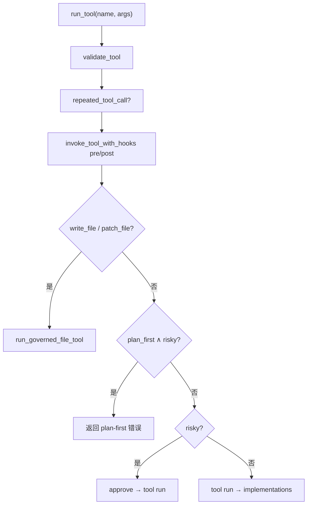

# Platform + Open 子系统

> **读者**：改工具、治理、协议解析，或理解 Open Loop 与 Graph 共用底座的人。  
> **上级文档**：[`ARCHITECTURE.md`](./ARCHITECTURE.md) · Graph 节点见 [`graph-subsystem.md`](./graph-subsystem.md)  
> **阶段史**：Phase 1 治理 [`phase1.md`](./phase1.md) · Phase 2 Hook [`phase2.md`](./phase2.md) · Phase 3 规划 [`phase3.md`](./phase3.md) · Phase 4 Skill [`phase4.md`](./phase4.md)

---

## 1. 子系统边界

`mini_coding_agent/platform/` 是 **Open Loop 与 Graph Harness 的共用运行时**。两种 mode 都通过 `MiniAgent.run_tool` 执行工具，共用 governance、protocol、session、models。

```
                    ┌─────────────────────────────────┐
                    │         platform/               │
                    │  tools · governance · protocol  │
                    │  session · hooks · models       │
                    └───────────────┬─────────────────┘
                                    │
              ┌─────────────────────┼─────────────────────┐
              ▼                     ▼                     ▼
      modes/open/agent.ask   graph/nodes/generate    graph/nodes/locate
      （多轮自由选 tool）      （1× LLM → run_tool）    （run_tool search/shell）
```

| 层 | 路径 | 职责 | 不应包含 |
|----|------|------|----------|
| **platform** | `platform/*` | 工具、治理、协议、会话、Hook | Gate/DAG/意图 |
| **open** | `modes/open/*` | `ask()` 多轮循环、prompt 形状 | 直接写盘 |
| **graph** | `modes/graph/*` | Gate、DAG、节点 | 绕过 `run_tool` 写文件 |

---

## 2. 为何 write_file / patch_file 不能直调 implementation

### 2.1 注册表设计

`build_tools()`（`platform/tools/registry.py`）中：

| 工具 | `risky` | 有 `run` 键？ | 实际执行 |
|------|---------|---------------|----------|
| `list_files` / `read_file` / `search` | 否 | ✅ → `implementations.*` | 直调 |
| `run_shell` | 是 | ✅ | `approve` → `tool_run_shell` |
| **`write_file`** | 是 | **❌ 无** | **仅** `governance.run_governed_file_tool` |
| **`patch_file`** | 是 | **❌ 无** | **仅** governance 链 |
| `make_plan` / `load_skill` / `delegate` | 否* | ✅ | implementations |

\* `delegate` 子 Agent 为 `read_only=True`。

**若给 write/patch 注册 `run`**：模型或节点可经 `execute_tool_after_validation` 的 `tool["run"](args)` 分支**绕过** diff、checkpoint、approve——违反 Phase 1 铁律。

### 2.2 强制入口

```77:84:mini_coding_agent/platform/tools/runtime.py
    if name in {"write_file", "patch_file"}:
        return run_governed_file_tool(agent, name, args)
    if tool["risky"] and not agent.approve(name, args):
        return f"错误：{name} 审批被拒绝"
    try:
        return clip(tool["run"](args))
```

Graph `generate` 节点同样调用 `agent.run_tool(name, args)`，与 Open 走**同一条**治理链。

### 2.3 治理链步骤

`governance.run_governed_file_tool`（详见 [`phase1.md`](./phase1.md)）：

```
读 before → proposed_file_content → unified diff
  → approve(diff) [ask/auto/never]
  → checkpoint 落盘 (.mini-coding-agent/checkpoints/)
  → atomic_write_text
  → 失败 → restore_checkpoint
```

| 产出 | 写入位置 |
|------|----------|
| `agent._last_tool_meta` | `diff_summary`, `checkpoint_id`, `rolled_back` |
| Open `ask()` | 合并进 history 的 tool record |
| Graph verify retry | `executor._load_generate_checkpoint` 用于回滚 |

---

## 3. run_tool 完整管道

**入口**：`MiniAgent.run_tool` → `platform/tools/runtime.run_tool`



| 步骤 | 模块 | 说明 |
|------|------|------|
| 校验 | `validators.validate_tool` | schema、路径沙箱 |
| 防循环 | `repeated_tool_call` | 连续相同调用 → 错误 |
| Hook | `invoke_tool_with_hooks` | `pre_tool` / `post_tool` |
| plan-first | `execute_tool_after_validation` | risky 前须本轮 `make_plan` 成功 |
| 沙箱 | `tools/sandbox.resolve_path` | 路径须在 repo_root 内 |

**路径沙箱**：`agent.path(rel)` → `resolve_path` → `path_is_within_root`。

---

## 4. 工具一览（platform 视角）

| 工具 | risky | Graph 使用 | 备注 |
|------|-------|------------|------|
| `list_files` | 否 | 少 | Open 探索 |
| `read_file` | 否 | locate snippet 内部等价逻辑 | |
| `search` | 否 | locate 回退 | rg 或 Python 回退 |
| `run_shell` | 是 | verify（pytest） | cwd=repo_root |
| `write_file` | 是 | generate（非 fix_bug 主路径） | 治理链 |
| `patch_file` | 是 | generate fix_bug | 7.2：系统可注入 old_text |
| `make_plan` | 否 | refactor 模板前 | `--plan-first` 门控 |
| `load_skill` | 否 | Gate skill 预加载 | |
| `delegate` | 否 | Open 为主 | 只读子 Agent，`depth < max_depth` |

实现细节：`platform/tools/implementations.py`。

---

## 5. 模型输出协议（protocol.py）

**纯函数**，无 `MiniAgent` 依赖。Open `ask()` 与 Graph `generate` 均调用 `parse(raw)`。

### 5.1 支持的格式

| 格式 | 示例 | 解析函数 |
|------|------|----------|
| JSON tool | `<tool>{"name":"patch_file","args":{...}}</tool>` | `_parse_tool_json_relaxed` |
| XML tool | `<tool name="write_file" path="a.py"><content>...</content></tool>` | `parse_xml_tool` |
| 结束 | `<final>...</final>` | — |
| 畸形 | — | `retry` + `retry_notice` |
| 纯文本兜底 | 无 tag | 当作 `final` |

### 5.2 patch_file 解析（Phase 7.2）

- 接受 **`path` + `new_text`**（`old_text` 可选）
- 容错：JSON 内 ``` 围栏、尾部多余 `}`、字段内 escape
- Graph generate 在 governance 前由 `_apply_fix_bug_guided_patch` 注入 `old_text`

### 5.3 Phase 7.3（protocol 容错 · 已落地部分）

| 问题 | 处理 |
|------|------|
| 整段 `` ```json `` 围栏 | `_unwrap_markdown_fences` |
| 围栏内无 `<tool>` 的裸 JSON | `_try_parse_bare_tool_json` |
| `new_text` 缺少闭合引号（含 f-string `{name}`） | `_extract_unclosed_json_string` 扫描至 `}}` |
| `syntaxerror_paren` / `nameerror_greet` | generate/verify ✅；剩余 `expect_files` 为模型 exact 内容 |

相关测试：`tests/test_generate_robust.py`（`test_protocol_parse_patch_file_*`）。

**failure_type**：`generate_protocol` → 优先 `protocol.py` + `nodes/generate.py` 代码块兜底。

---

## 6. Open Loop（modes/open）

### 6.1 MiniAgent 与 ask()

**源码**：`modes/open/agent.py` · `modes/open/prompt.py`

| 项 | 说明 |
|----|------|
| **入口** | `agent.ask(user_message)` |
| **循环** | `complete → parse → run_tool` 直到 `<final>` 或步数/attempt 上限 |
| **prompt** | 稳定 `prefix` + `memory` + `history` + 当前 user_message |
| **步数** | `max_steps`（默认 6）；`max_attempts = max(max_steps*3, max_steps+4)` |
| **retry** | `parse` 返回 retry → 记入 history，**不占** tool_steps |

### 6.2 与 Graph 的分流

| 触发 | 路径 |
|------|------|
| CLI 默认 `--harness off` | 全部 `ask()` |
| Gate `confidence=low` | `handle_ask` → `ask()` |
| Gate high + pipeline | **不**进 Open；走 DAG |
| Pipeline 失败 | 错误文案，**不**降级 Open（7.2+） |

### 6.3 Open 独有 vs 共享

| 能力 | Open | Graph |
|------|------|-------|
| 多轮任意 tool | ✅ | ❌（节点限定） |
| `--plan-first` | ✅ 每 ask 重置 | N/A（refactor 用 memory.plan） |
| `--skills` 预加载 | ✅ | Gate skill 也可 load |
| Hook pre/post ask/llm | ✅ | generate 仅 pre/post tool（经 run_tool） |
| session history | ✅ 完整 transcript | harness 字段额外写入 |

---

## 7. Session 与 Checkpoint

### 7.1 SessionStore

**路径**：`<repo>/.mini-coding-agent/sessions/<id>.json`

| 字段 | 含义 |
|------|------|
| `history[]` | user / assistant / tool 消息 |
| `memory.task` | 首轮 user 消息 clip(300) |
| `memory.files` / `notes` | 近期文件与工具摘要 |
| `memory.plan` | Phase 3 `make_plan` 结果 |
| `memory.loaded_skills` | Phase 4 Skill 正文 |
| `last_gate` / `harness_trace` / … | Graph 专用（见 graph-subsystem） |

每次 `record()` 自动 `session_store.save()`。

### 7.2 CheckpointStore

**路径**：`<repo>/.mini-coding-agent/checkpoints/<session_id>/<cp-id>.json`

| 字段 | 用途 |
|------|------|
| `path`, `content`, `existed`, `sha256_before` | 写前快照 |
| Graph verify retry | `restore_checkpoint` + tests 快照恢复 |

`/reset`（CLI）：清 history、harness 字段；**不删** checkpoint 目录与 rig.db。

---

## 8. Hook 体系（Phase 2）

**注册**：`HookRegistry` · `hooks/builtin.py` · 可选 `hooks.yaml`

| 事件 | 触发点 | 典型用途 |
|------|--------|----------|
| `pre_tool` / `post_tool` | `run_tool` 校验后 | trace、shell 审计 |
| `pre_ask` / `post_ask` | `ask()` 入口/finally | ask timing |
| `pre_llm` / `post_llm` | Open 每轮 complete 前后 | 耗时、展示 |

Graph pipeline **不**发 ask/llm Hook；节点内 `run_tool` 仍发 tool Hook。

**落盘**：`ask_timing` → `.mini-coding-agent/logs/<session>.jsonl`

详见 [`phase2.md`](./phase2.md) · [`02-codebase-reference.md`](./02-codebase-reference.md) §10。

---

## 9. 其它 platform 模块

| 模块 | 职责 |
|------|------|
| `models.py` | `OllamaModelClient`、`FakeModelClient`（eval/L2） |
| `workspace.py` | Git 状态、文档片段 → prefix |
| `planning.py` | `make_plan` prompt 与 JSON 解析 |
| `skills.py` | `SkillCatalog.scan`、SKILL.md 加载 |
| `constants.py` | `MAX_TOOL_OUTPUT`、`IGNORED_PATH_NAMES` 等 |
| `wait_display.py` | Gate/Generate/Open 等待提示 |

Prompt 形状（prefix / history 截断）在 **`modes/open/prompt.py`**，不在 platform 包内。

---

## 10. 诊断速查

| 现象 | 优先看 |
|------|--------|
| 写盘无 diff / 无 checkpoint | 是否绕过 `run_tool`（应不存在） |
| patch old_text 0 match | `governance.proposed_file_content`；generate 注入/normalize |
| 审批被拒 | `approval_policy`、`read_only` |
| plan-first 拦截 | 本轮是否先 `make_plan` |
| 路径越界 | `validators` + `sandbox` |
| tool JSON 解析失败 | `protocol._parse_tool_json_relaxed` |
| Open 死循环 | `repeated_tool_call`、`max_attempts` |

---

## 11. 相关测试

| 文件 | 覆盖 |
|------|------|
| `tests/test_mini_coding_agent.py` | ask 循环、governance metadata、回滚 |
| `tests/test_generate_robust.py` | protocol 容错、new_text-only |
| `tests/test_harness_fix_bug_e2e.py` | generate 经 run_tool 治理 |
| `tests/test_eval_contract.py` | FakeModel 契约（L2） |

---

## 12. 文档交叉引用

| 主题 | 文档 |
|------|------|
| 变更治理决策 | [`phase1.md`](./phase1.md) |
| Hook / 可观测 | [`phase2.md`](./phase2.md) |
| Graph 节点 | [`graph-subsystem.md`](./graph-subsystem.md) |
| 模块路径速查 | [`02-codebase-reference.md`](./02-codebase-reference.md) §4–7 |

---

*platform-subsystem.md · Batch 4 · 2026-06-08*
