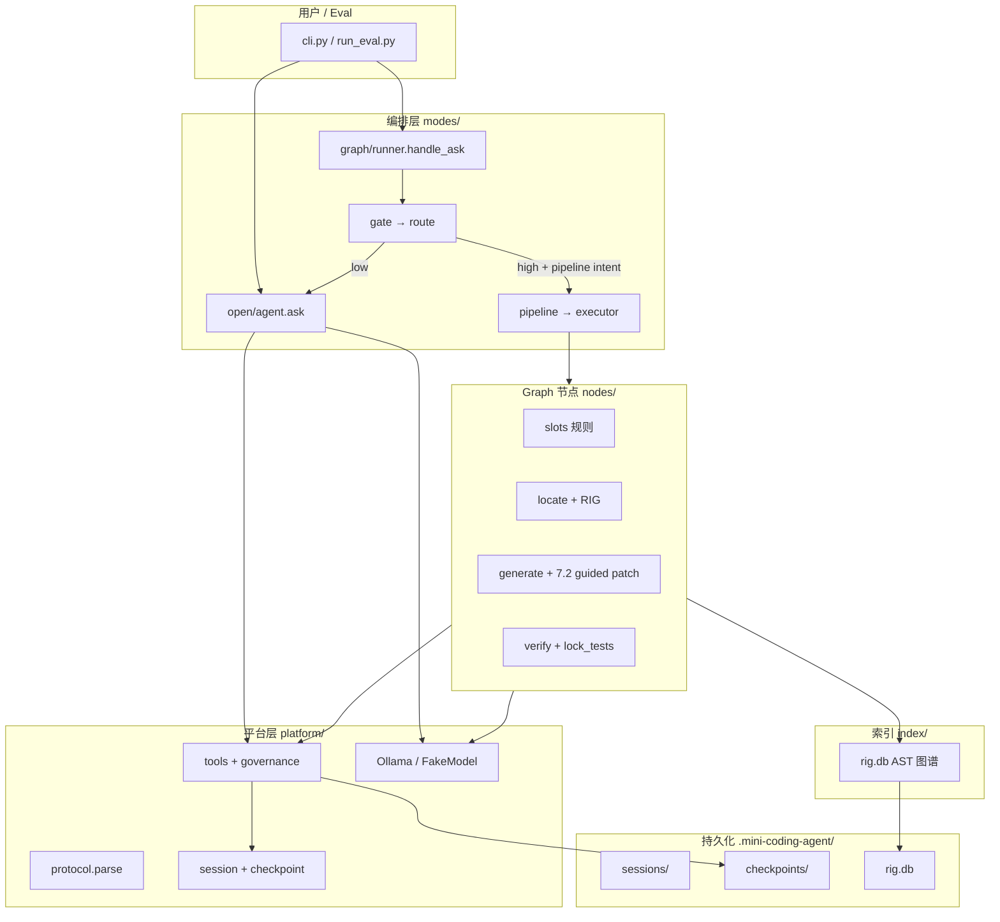

# 项目架构整理 — 总体规划

> **状态**：📋 规划稿（Batch 0）  
> **目标**：把整个项目的**代码架构 + 文档体系 + eval 体系**整理成「新人/未来的自己 30 分钟能看懂、改代码知道动哪一层」的状态。  
> **原则**：像 Phase 7 一样**分批交付**，每批有 Done Definition，不追求一次写完。

---

## 1. 为什么要做这件事

当前仓库**能跑、能测**，但信息分散：

| 问题 | 表现 |
|------|------|
| 文档多且旧 | `docs/command/`、`feedback/` 历史派活；`phase5-graph.md` 仍写 open 降级 |
| 架构无单一入口 | 无 `ARCHITECTURE.md`；`02-codebase-reference.md` 偏模块列表，缺端到端图 |
| Eval 与代码脱节 | L2 仅 7/19 任务有 `architecture`；L1 spec 与 `tests/diagnostic/` 不一致 |
| 分数/基线口径混 | 2/5、7/19、5/8 指不同任务集 |
| Phase 7 未并入总架构 | 7.2 改了 generate/runner/RIG，总图未更新 |

**整理不是重写代码**，而是：**一张总图 + 分层职责 + 文档索引 + Stale 标记清理 + 按需补测试契约**。

---

## 2. 系统总览（目标态）

### 2.1 逻辑分层



### 2.2 两条执行路径

| 路径 | 触发 | 特点 |
|------|------|------|
| **Graph Harness** | `--harness on` 或 eval | Gate → 静态 DAG → 节点确定性执行；fix_bug 主战场 |
| **Open Loop** | 默认 CLI / Gate low | 模型自由选 tool，多轮循环 |

**当前产品决策（Phase 7.2 已落地）**：

- Harness 前 **自动 ensure_rig**
- Pipeline 失败 **不降级 open**（仅 Gate low 仍走 open）
- fix_bug generate：**系统 old_text + LLM new_text**

### 2.3 fix_bug 数据流（权威版）

```
用户 message
  → handle_ask(harness_enabled=True)
  → classify_gate (1× LLM)
  → [route=harness_pipeline & fix_bug]
  → ensure_rig
  → fill_slots (无 LLM)
  → locate: RIG → neighbor → search 回退
  → generate: 引导 prompt → parse/tool 或代码块兜底 → governance patch
  → verify: lock_tests → pytest|py_compile
  → [retry ≤2: 回滚 checkpoint + test baseline → generate]
  → 成功文案 | 失败「流水线失败：…」
```

Eval 平行路径：临时目录 + `tasks.json` setup → 同上 → grading + `stage_trace` 归档。

---

## 3. 物理目录 ↔ 职责（目标索引）

| 路径 | 层级 | 职责 | 架构文档归属 |
|------|------|------|--------------|
| `mini_coding_agent/cli.py` | 入口 | REPL、参数、rig 子命令 | Batch 1 §入口 |
| `modes/graph/runner.py` | 编排 | Gate 分流、pipeline 调用 | Batch 1 §Harness |
| `modes/graph/gate.py` | 编排 | 意图分类 | Batch 2 §Gate |
| `modes/graph/slots.py` | 编排 | 槽位规则 | Batch 2 §Slots |
| `modes/graph/planner.py` | 编排 | 模板加载 | Batch 2 |
| `modes/graph/executor.py` | 编排 | DAG 执行、retry | Batch 1 §Executor |
| `modes/graph/pipeline.py` | 编排 | RIG + plan + execute | Batch 1 |
| `modes/graph/nodes/locate.py` | 节点 | RIG + search | Batch 3 [`graph-subsystem.md`](./graph-subsystem.md) §4 |
| `modes/graph/nodes/generate.py` | 节点 | LLM patch | Batch 3 §5 |
| `modes/graph/nodes/verify.py` | 节点 | pytest/py_compile | Batch 3 §5 |
| `modes/graph/verify_rules.py` | 节点 | lock_tests、回滚 | Batch 3 |
| `modes/graph/harness_trace.py` | 可观测 | stage_trace | Batch 4 §Observability |
| `modes/open/agent.py` | Open | 自由 tool 循环 | Batch 1 §Open |
| `platform/governance.py` | 平台 | 写盘治理 | Batch 4 [`platform-subsystem.md`](./platform-subsystem.md) §2 |
| `platform/protocol.py` | 平台 | 输出解析 | Batch 4 §5 |
| `platform/tools/*` | 平台 | 工具实现 | Batch 4 §3–4 |
| `index/*` | 索引 | RIG 建图/查询 | Batch 3 §RIG |
| `eval/run_eval.py` | Eval L4 | Live 探针 | Batch 4 §Eval |
| `eval/task_schema.py` | Eval L2 | 契约断言 | Batch 4 |
| `eval/tasks.json` | Eval | 任务单一真相源 | Batch 5 |
| `tests/diagnostic/` | Eval L1 | 组件诊断 | Batch 5 |
| `tests/test_eval_contract.py` | Eval L2/L3 | FakeModel 契约 | Batch 5 |

---

## 4. 文档体系（目标态）

### 4.1 三层文档

```
docs/struct/          ← 产品架构（阶段、决策、总图）  【主 Agent 维护】
docs/eval/            ← Eval 五层规格（L1–L5）      【设计规格】
eval/README + runs/   ← Eval 操作与跑分产物          【操作手册 + artifact】
docs/command|feedback ← 历史派活与回报（只读归档）     【不扩写】
docs/my_research/     ← 用户调研笔记                  【用户维护】
```

### 4.2 目标：单一入口链

```
README.md（仓库）
    └── docs/README.md（文档索引）
            ├── struct/project-architecture-plan.md  ← 本文（总规划）
            ├── struct/ARCHITECTURE.md               ← Batch 1 产出（系统总览）
            ├── struct/02-codebase-reference.md      ← Batch 2 刷新（模块速查）
            ├── struct/phase7.md                     ← 当前迭代主线
            └── eval/README.md + eval/runs/README.md ← 怎么跑、结果在哪
```

### 4.3 待废弃 / 需标注 Stale 的文档

| 文档 | 问题 | Batch |
|------|------|-------|
| `phase5-graph.md` §5.2 | pipeline fail → open | Batch 2 ✅ |
| `docs/eval/06-l1-diagnostic-spec.md` | 文件列表与 repo 不符 | Batch 5 ✅ |
| `types.py` 注释 | 错误文件名 phase5-graph-harness | Batch 2 ✅ |
| `01-vision-and-roadmap.md` | 未提 Phase 7 | Batch 6 ✅ |
| 多处 live 分数 | 口径不一 | Batch 4（统一到 runs/README） |

**不删除** `command/`、`feedback/` — 仅在本规划中标为**历史归档**，新工作写 struct/phase* 与 eval/QA_LOG。

---

## 5. Eval 五层 ↔ 代码映射（目标态）

| 层 | 回答的问题 | 代码入口 | 文档 | 当前缺口 |
|----|------------|----------|------|----------|
| **L1** | 组件 I/O 对吗 | `tests/diagnostic/` | `06-l1-diagnostic-spec.md` | 仅 slots/locate 独立；gate/protocol 散在 harness 测试 |
| **L2** | 管线契约对吗 | `test_eval_contract.py` + `fake_script` | `07-l2-contract-spec.md` | 7/19 任务有契约 |
| **L3** | 架构维度 bench | B1–B5 `dimension` 任务 | `08-l3-arch-bench-spec.md` | 5 条在 tasks.json |
| **L4** | 真模型能力 | `run_eval.py` | `09-l4-live-probe-spec.md` | 基线未正式 save 到 baselines/ |
| **L5** | 踩坑不复现 | `regression/test_discovered_bugs.py` | `QA_LOG.md` | 7.3 项待补 |

---

## 6. 分批实施计划

> 预计 **6–8 批**，每批 1–2 小时量级，可独立验收。  
> 顺序：**先总览与权威数据流 → 再模块深描 → 再 eval 对齐 → 最后扫 stale**。

### Batch 0 — 规划（本文）✅

**交付**：`project-architecture-plan.md` + 更新 `struct/README.md` 索引。

**Done**：团队（你）认可分批顺序与目标态。

---

### Batch 1 — 系统总览文档 `ARCHITECTURE.md` ✅

**交付**：

- [`docs/struct/ARCHITECTURE.md`](./ARCHITECTURE.md)
- 根 `README.md` 增加 Architecture documentation 链接

**Done Definition**：

- [x] 新人只看 ARCHITECTURE + phase7 能说出 fix_bug 五步
- [x] 与当前 runner/generate 行为一致（无 pipeline open 降级）

---

### Batch 2 — 刷新 `02-codebase-reference.md` + 修复 Stale ✅

**交付**：

- 合并 Phase 7 模块：`harness_trace`、`ensure_rig`、guided generate
- 更新 Graph 路由表（Gate low → open；pipeline fail → 错误）
- 修正 `types.py` 等错误注释
- `phase5-graph.md` 仅改 **与事实冲突** 的段落（标注「7.2 变更」）

**Done Definition**：

- [x] codebase-reference 与 ARCHITECTURE 无矛盾
- [x] phase5 §5.2 与 runner.py 一致

---

### Batch 3 — 节点深描（Graph 子系统）✅

**交付**：[`docs/struct/graph-subsystem.md`](./graph-subsystem.md)

| 小节 | 内容 |
|------|------|
| Gate + Slots | prompt、规则、边界用例 |
| Locate + RIG | 查询顺序、neighbor、失败模式 |
| Generate + Verify | 7.2 引导 patch、governance 链、retry 回滚 |

**Done Definition**：

- [x] 每个节点有 I/O 表 + 指向源码路径
- [x] 与 `stage_trace` 字段一一对应

---

### Batch 4 — Platform + Open 子系统 ✅

**交付**：[`docs/struct/platform-subsystem.md`](./platform-subsystem.md)

- Tools 注册与 risky 治理链
- protocol 两种格式 + 7.3 待做（json 围栏）
- Open loop 与 Graph 共享部分
- Hooks / Session / Checkpoint

**Done Definition**：

- [x] 说清 write_file/patch_file 为何不能直调 implementation
- [x] 链接到现有 phase1/phase2 文档，不重复长篇

---

### Batch 5 — Eval 体系对齐 ✅

**交付**：

- 更新 `docs/eval/02-five-layer-system.md` 与 `06-l1-diagnostic-spec.md` 反映**实际**测试布局
- `eval/baselines/live-qwen2.5-coder-7b-post72.json` 正式基线（全量 19 post-7.2）
- 决策：[`eval/L4-ONLY-DECISION.md`](../../eval/L4-ONLY-DECISION.md)（12 条 L4-only，7 条 L2 契约）

**Done Definition**：

- [x] L1–L5 每层「跑什么命令」可在 eval/README 一张表找到
- [x] baselines 与 runs/README 口径一致

---

### Batch 6 — Phase 索引与愿景同步 ✅

**交付**：

- 更新 `01-vision-and-roadmap.md`：Phase 7 纳入路线图
- `docs/README.md` 文档地图与 struct/README 完全同步
- [`phase7.3-outline.md`](./phase7.3-outline.md)（protocol + no_file_hint）

**Done Definition**：

- [x] docs/README 不再出现「Eval 波次 C 进行中」等过时句

---

### Batch 7 — 可选：架构 Mermaid 图集 / Canvas

**交付**：

- `docs/struct/diagrams/` 或单文件 `diagrams.md`
- Gate 决策树、retry 状态机、eval 报告字段结构

**Done**：用于作品集展示 / 面试讲解。

---

### Batch 8 — 可选：L2 契约扩展

**交付**：

- 为 Generate 专项 8 条中尚无 `architecture` 的任务补最小契约
- 或明确标注 `l4_only: true` 字段（需改 task_schema）

**仅在 Batch 5 决策后执行**。

---

## 7. 不在范围内（避免 scope creep）

| 不做 | 原因 |
|------|------|
| 重写 `command/`、`feedback/` 历史 | 归档即可 |
| 合并/删除 phase1–5 文档 | 保留阶段史 |
| 新 pip 依赖 | 铁律 |
| 全面 API autodoc | 作品集非库项目 |
| 一次补全 19 条 L2 fake_script | 工作量大，Batch 8 可选 |

---

## 8. 验收标准（整个整理项目）

1. **单一入口**：`docs/struct/ARCHITECTURE.md` 存在且准确  
2. **无重大 stale**：phase5 路由、7.2 行为、eval 指标三处一致  
3. **Eval 可复述**：能画出 L1–L5 与命令对照  
4. **改 bug 可定位**：live `failure_type` → 模块映射在 ARCHITECTURE 中可查  
5. **产物有归档**：live 只在 `eval/runs/`，基线在 `eval/baselines/`

---

## 9. 建议执行顺序与时间预期

| 批次 | 预估 | 依赖 |
|------|------|------|
| Batch 0 规划 | ✅ 完成 | — |
| Batch 1 ARCHITECTURE | ✅ 完成 | Batch 0 |
| Batch 2 速查刷新 | ✅ 完成 | Batch 1 |
| Batch 3 Graph 深描 | ✅ 完成 | Batch 1 |
| Batch 4 Platform | ✅ 完成 | Batch 1 |
| Batch 5 Eval 对齐 | ✅ 完成 | Batch 1 |
| Batch 6 索引同步 | ✅ 完成 | Batch 2–5 |
| Batch 7 图集 | 可选 | Batch 1 |
| Batch 8 L2 扩展 | 可选 | Batch 5 决策 |

**推荐下一轮**：**Phase 7.3 实现**（按 [`phase7.3-outline.md`](./phase7.3-outline.md)）或可选 **Batch 7** 图集。

---

## 10. 当前代码事实快照（2026-06-08，整理基准）

| 指标 | 值 |
|------|-----|
| tasks.json | 19 条 |
| L2 契约任务 | 7 条 |
| Generate 专项 live（7.2 后） | 5/8（含 off_by_one） |
| 全量 live（7.2 后） | **8/19** · `eval/baselines/live-qwen2.5-coder-7b-post72.json` |
| 全量 live（7 改前） | 7/19 |
| Phase | 7.1 ✅ · 7.2 ✅ · 7.3 📋 |
| Pipeline → open | ❌ 已取消 |
| stage_trace | ✅ 每次 eval |

---

*project-architecture-plan.md · Batch 0 · 2026-06-08*
